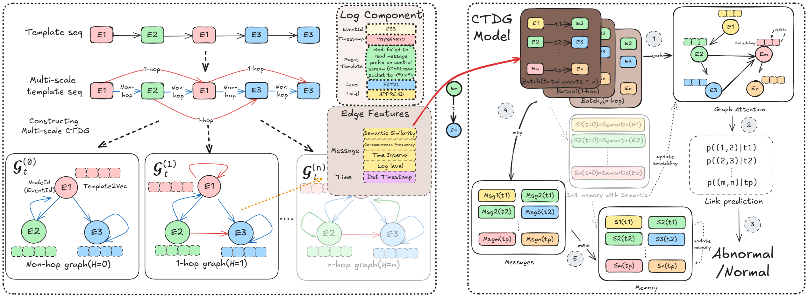

# TempoLog

## Abstract

The raw log messages are formatted to log templates and represent each template as a dense semantic vector. Then, we construct a multi-scale CTDG based on varying hops of template sequence. Subsequently, we design a semantic-aware TempoLog model to represent the template feature at certain timestamps. Finally, a link prediction model determines whether an edge exists between two nodes, enabling end-to-end training.

By leveraging CTDGs, we eliminate the need for fixed-size windows, enabling the model to capture temporal and contextual dependencies between events dynamically. Additionally, the semantic-aware TempoLog model ensures event-level anomaly detection by learning patterns across varying hops of event interactions. This design directly addresses context bias and fuzzy localization, providing a more accurate, interpretable, and efficient solution for anomaly detection in discrete event sequences. 



## Demo

This document will introduce how to run the entire project using the BGL dataset as an example.

### 1. LogParser

First, download the raw dataset and place it under the `./data/BGL` directory.  
Then, run the `parser.py` file under the `./dataloader` directory (make sure to modify the corresponding dataset). This will generate a `parser` directory in the dataset folder, which will store the processed data: `./data/BGL/parser/BGL.log_structured.csv` and `./data/BGL/parser/BGL.log_templates.csv`.

### 2. bert2vec

Run the `./dataloader/bert2vec.py` to generate the `vec.pt` file in the data directory.

```
# The data format is as follows
data_dict = {
    'EventId': vec_df['EventId'].values,
    'EventTemplate': vec_df['EventTemplate'].values,
    'EventVector': event_vector_tensor
}
```

### 3. Dataloader

Run the `temporaldataloader.py` file (make sure to modify the dataset name).  
Set the value of `interval` to determine the 'H' for generating the dataset.  
When running for the first time, ensure that the `save_temporal_data` function's `data = remove_duplicate(data)` works correctly.  
This file uses multithreading to process log data by default but also provides a single-threaded interface.

### 4. Model Training

Run the `./test/multi_tgn_run.py` file to train the model.
